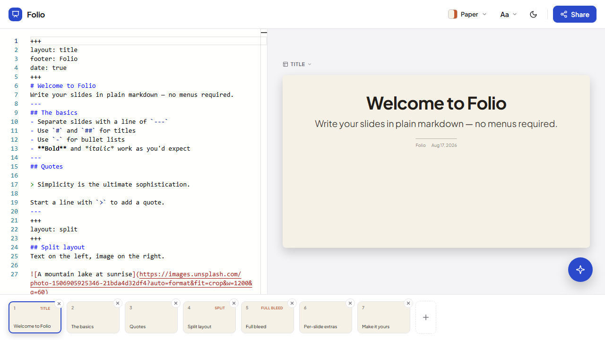

# Slidown

## Idea

Slidown came from a common presentation pain point: every time I need to present something, I have to open PowerPoint or another slide tool and spend too much time formatting instead of thinking about content.

The goal is to let developers, and eventually broader users too, create presentations from Markdown or AI-generated content. Instead of building slides manually, users should be able to write, prompt, or transform content into a presentation-ready format much faster.

## Main experience

- Create presentations without the usual PowerPoint busywork
- Turn Markdown writing into slide decks quickly
- Use AI to help draft or transform presentation content
- Customize themes, accents, and typography without heavy design work
- Make presentation creation faster for developers and other users

## Tech

- HTML
- JavaScript
- Markdown parsing
- Design prototype runtime

## Notes

This repository is currently a front-end prototype.
